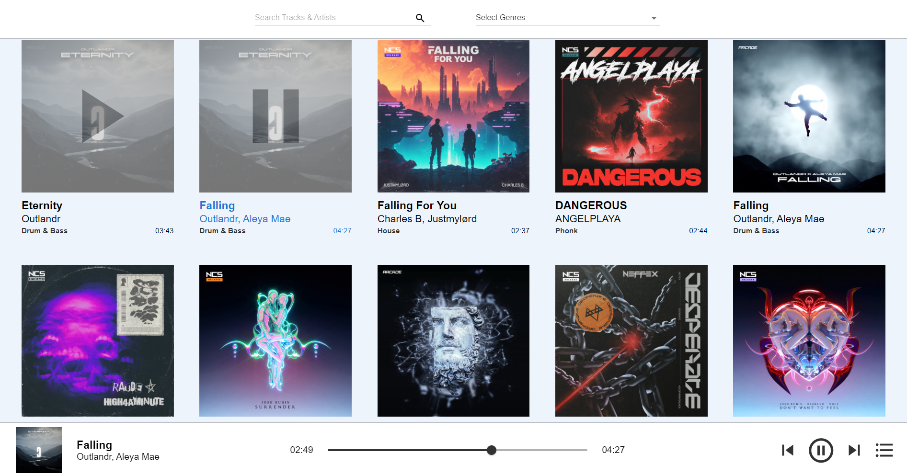

# Музыкальное приложение на React

## Описание
Музыкальное приложение, использующее данные треков с сайта NCS сохраненные в json файле. 

Интерфейс состоит из шапки и тела:
* **Шапка**: содержит поисковую строку и список жанров.
* **Тело**: отображает отсортированные треки и пагинацию для переключения страниц.

Дополнительный элемент интерфейса — **плейбар**, который показывает текущий трек и включает элементы управления для переключения треков и открытия плейлиста.

* [MUSIC APP](https://goldmusic.netlify.app/)


## Функциональность
### Пользовательские элементы управления
* Поиск:
    * Позволяет искать по выбранной категории трека.
    * Если категория не выбрана, поиск осуществляется по всем трекам.
* Плейлист:
    * Формируется на основе текущего поискового запроса и выбранного жанра.
* Воспроизведение треков:
    * Треки воспроизводятся по очереди в зависимости от текущего плейлиста.
    * Изменение сортировки не влияет на порядок воспроизведения, пока пользователь не выберет новый трек.
 
## Использование
* Запустите приложение и используйте поисковую строку для поиска треков.
* Выберите жанр для фильтрации треков.
* Используйте плейбар для управления воспроизведением треков и открытия плейлиста.
      
## Установка
Выполните следующие действия, чтобы установить и запустить проект:

1. **Клонируйте репозиторий**:
  ```bash
  git clone https://github.com/bidzyu/mysnake.git
  ```

2. **Перейдите в каталог проекта**:
  `cd mysnake`

3. **Установите зависимости**:
  `npm install`

4. **Запустите проект в режиме разработки**:
  `npm run dev`

## Используемые технологии
**Основные**:
- [React](https://react.dev) - библиотека для создания пользовательских интерфейсов
- [TypeScript](https://www.typescriptlang.org/docs/) - язык программирования, основанный на JavaScript
- [Redux toolkit](https://redux-toolkit.js.org/) - библиотека для управления состоянием в приложениях на основе Redux
- [Vite](https://vite.dev/guide/) - современный сборщик проектов
- [npm](https://www.npmjs.com) - менеджер пакетов

**Стили**:
- [Sass](https://sass-lang.com) - CSS препроцессор.

## Скрипты
-  `npm run dev` — Запускает проект в режиме разработки с помощью Vite.
-  `npm run build` — Компилирует проект с помощью TypeScript и создает сборку с помощью Vite.
-  `npm run lint` — Проверяет код на наличие ошибок с помощью ESLint.
-  `npm run preview` — Предварительный просмотр сборки проекта.


